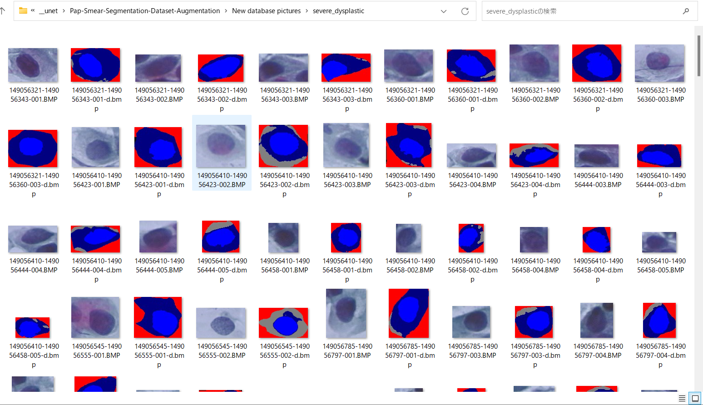
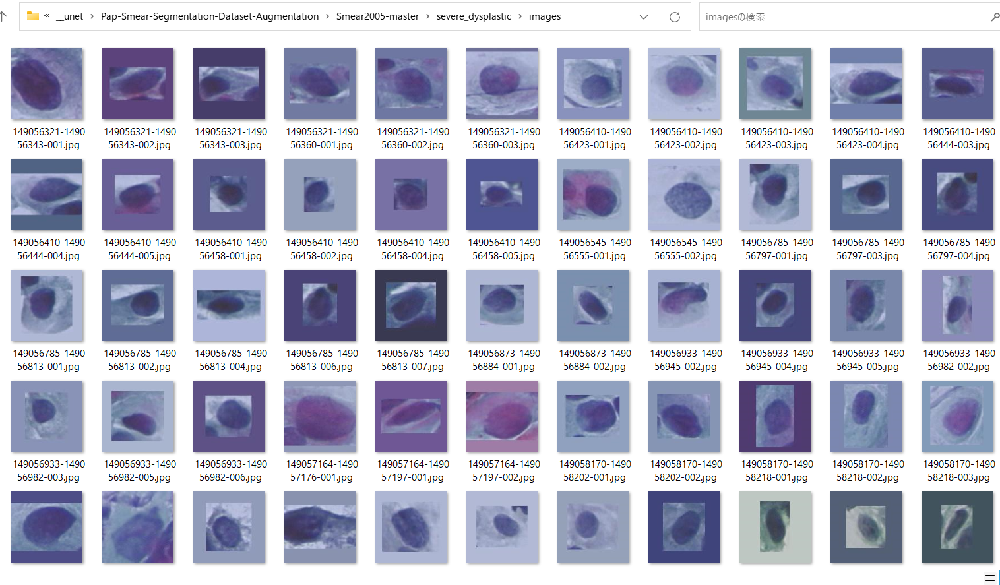
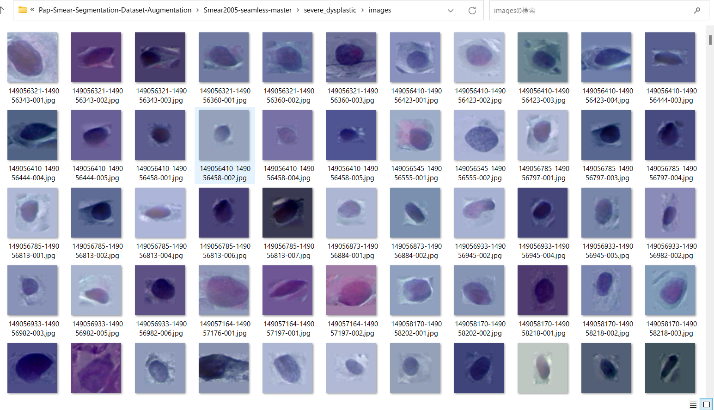

# Pap-Smear-Segmentation-Dataset-Augmentation (2023/07/24)
<h2>
1 Pap-Smear dataset
</h2>

The image dataset used here has been taken from the following web site.

<pre>
PAP-SMEAR (DTU/HERLEV) DATABASES & RELATED STUDIES
https://mde-lab.aegean.gr/index.php/downloads/
Part II : smear2005.zip [85.17 MB] New Pap-smear Database (images)
</pre>
<pre>
This is the new website that hosts the DTU/Herlev Pap Smear Databases, as well as selected studies and papers 
related to these data. For more than 10 years, Dr Jan Jantzen works on pap-smear data acquired from images of 
healthy & cancerous smears coming from the Herlev University Hospital (Denmark), thanks to Dr MD Beth Bjerregaard.
The Old Pap Smear Database was formed in the late 90’s while the New Pap Smear Database (improved) was formed 
within 2005. The analysis of these databases was made through several Master Theses most of which where elaborated 
in Denmark, under the supervision of Dr Jantzen, while he was joining DTU, Dept. of Automation (Denmark) and also 
through collaboration to other researchers from around the world, many of which were made with G.Dounias and his
research team of the MDE-Lab, University of the Aegean. During the last years, Dr Jantzen collaborates with the 
University of the Aegean, Dept. of Financial and Management Engineering (FME) as teaching associate of the 
Postgraduate Program of the FME-Dept. and as research associate of the MDE-Lab. The site will be continuously 
updated with new papers, studies, theses and citations related to the hosted pap-smear databases.

In case you use material from this site, please cite the current link and related studies.
</pre>

<h2>
2 New database pictures
</h2>
The New database pictures has the following folder structure, which contains seven categories as shown below. 
<pre>
./New database pictures
├─carcinoma_in_situ
├─light_dysplastic
├─moderate_dysplastic
├─normal_columnar
├─normal_intermediate
├─normal_superficiel
└─severe_dysplastic
</pre>

For example, severe_dysplastic folder contains image and mask files as shown below. 
 

<h2>
3 Generate non-seamless images
</h2>
Please run the following bat file. 
<pre>
>1.genenrator.bat
</pre>

,which runs the following command. 
<pre>
>python ImageMaskDatasetGenerator.py ./image_mask_generator.config
</pre>
, where <b>image_mask_generator.config</b> is the following. 
<pre>
; image_mask_generator.config
; Copyright (C) antillia.com
; 2023/07/24

[generator]
base_dir   = "./New database pictures"
output_dir = "./Smear2005-master"
resize     = 312
cropsize   = 128
seamless_cloning = False

[maskcolor]
carcinoma_in_situ    = (255,    0,   0)
light_dysplastic     = (  0,  255,   0)
moderate_dysplastic  = (  0,    0, 255)
normal_columnar      = (255,  255,   0)
normal_intermediate  = (255,    0, 255)
normal_superficiel   = (  0,  255, 255)
severe_dysplastic    = (255,  255, 255)
</pre>

Running the bat file above, Smear2005-master dataset is created. 
<pre>
./Smear2005-master
├─carcinoma_in_situ
│  ├─images
│  └─masks
├─light_dysplastic
│  ├─images
│  └─masks
├─moderate_dysplastic
│  ├─images
│  └─masks
├─normal_columnar
│  ├─images
│  └─masks
├─normal_intermediate
│  ├─images
│  └─masks
├─normal_superficiel
│  ├─images
│  └─masks
└─severe_dysplastic
    ├─images
    └─masks
</pre> 

<b>severe_dysplastic images samples</b>: 
 

<h2>
4 Generate seamless images
</h2>
Pleasen run the following bat file. 
<pre>
>2.seamless_generator.bat
</pre>

,which runs the following command. 
<pre>
>python ImageMaskDatasetGenerator.py ./image_mask_generator_seamless.config
</pre>
, where <b>image_mask_generator_seamless.config</b> is the following. 
<pre>
; image_mask_generator_seamless.config
; Copyright (C) antillia.com
; 2023/07/24

[generator]
base_dir   = "./New database pictures"
output_dir = "./Smear2005-seamless-master"
resize     = 312
cropsize   = 128
seamless_cloning = True

[maskcolor]
carcinoma_in_situ    = (255,    0,   0)
light_dysplastic     = (  0,  255,   0)
moderate_dysplastic  = (  0,    0, 255)
normal_columnar      = (255,  255,   0)
normal_intermediate  = (255,    0, 255)
normal_superficiel   = (  0,  255, 255)
severe_dysplastic    = (255,  255, 255)

</pre>

Running the bat file above, Smear2005-seamless-master dataset is created. 
<pre>
./Smear2005-seamless-master
├─carcinoma_in_situ
│  ├─images
│  └─masks
├─light_dysplastic
│  ├─images
│  └─masks
├─moderate_dysplastic
│  ├─images
│  └─masks
├─normal_columnar
│  ├─images
│  └─masks
├─normal_intermediate
│  ├─images
│  └─masks
├─normal_superficiel
│  ├─images
│  └─masks
└─severe_dysplastic
    ├─images
    └─masks
</pre> 

<b>severe_dysplastic images samples</b>: 
 

<h2>
5 Image Segmentation
</h2>
From above comaparion between non-seamlessly-cloned and seamlessly-cloned images, 
the latter seems to be more natural than the former for human eyes. 
However, the seamless-cloning may cause some changes in pixel level in the original image by the cloning process.
which may not be so good to improve accuracy in an image segmentation by UNET. 
 
See also:
<a href="https://github.com/sarah-antillia/Image-Segmentation-Pap-Smear">Image-Segmentation-Pap-Smear</a>

